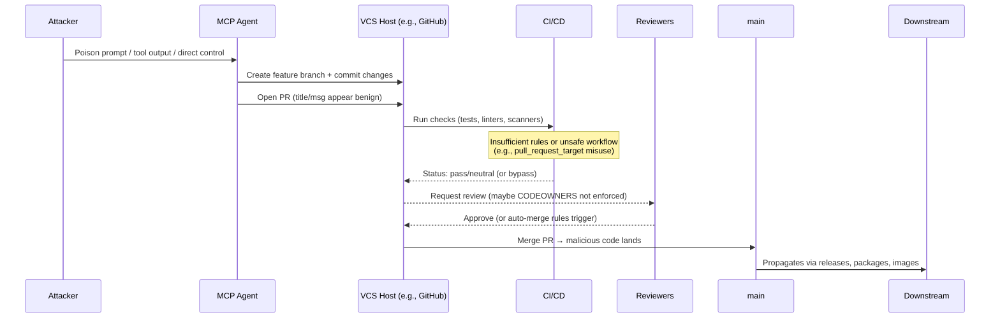

# SAFE‑T2103 — Code Sabotage (Agent commits malicious PR into repo)

> **Technique type:** Impact (ATK‑TA0040)  
> **SAFE‑MCP ID:** SAFE‑T2103  
> **Status:** Stable  
> **Severity:** High  
> **First observed (in the wild):** 2018–2021 open‑source incidents demonstrating feasibility (e.g., `event‑stream` dependency hijack; Linux “hypocrite commits”). [1][2][3][4]  
> **Last updated:** 2025‑11‑29

---

## Summary

Adversaries can manipulate an AI agent (or operate a compromised/malicious agent) to **propose or commit code changes that introduce backdoors, exfiltration paths, or latent vulnerabilities** into a target repository. In Model Context Protocol (MCP) environments, agents commonly have access to developer tooling (e.g., Git/GitHub clients, CI/CD) via MCP servers/tools. If repository permissions and CI policies are weak, a poisoned or over‑privileged agent can open a **pull request (PR)** that appears legitimate—passing tests and code style checks—yet embeds harmful logic or dependency changes that will be merged and shipped downstream.

Real‑world precedents show this class of attack is feasible even without AI: the 2018 `event‑stream` compromise inserted malicious dependency code that targeted cryptocurrency wallets, and the 2021 Linux “hypocrite commits” incident demonstrated how seemingly benign patches could smuggle subtle bugs. [1][2][3][4] With MCP‑connected agents capable of autonomous coding and PR workflows, the **time‑to‑impact and blast radius** increase unless organizations enforce rigorous trust and review controls.

> **SAFE‑MCP context:** SAFE‑T2103 appears in the SAFE‑MCP TTP table under **Impact** as “Code Sabotage — Agent commits malicious PR into repo.” [5]

---

## ATT&CK® mappings (informative)

- **T1195 – Supply Chain Compromise** (incl. **T1195.001** Compromise Dependencies/Dev Tools; **T1195.002** Compromise Software Supply Chain). [6][7][8]
- **T1565 – Data Manipulation** (impact by altering source code/data to influence downstream behavior). [9]
- **T1553 – Subvert Trust Controls** (e.g., abusing review/signing policies or misconfigurations to gain trust). [10]

---

## Why it matters

- **Integrity risk:** Malicious PRs change the canonical source of truth; downstream consumers inherit the compromise.
- **Supply‑chain amplification:** A single merged change can propagate to **thousands of dependents** (packages, services, containers). [1][7]
- **Agentic acceleration:** MCP‑connected agents can iterate and re‑submit until reviews pass, and may also **modify CI workflows** to escalate (e.g., unsafe `pull_request_target` patterns). [11][12][13]

---

## Attack vectors

**Primary**
- **Agent‑driven PR with planted backdoor** (e.g., obfuscated logic, environment‑driven payloads, covert exfiltration calls).
- **Dependency file manipulation** (e.g., add/update a dependency that contains malicious code or post‑install scripts). [1][3][7]
- **CI workflow escalation via PR** (e.g., introduce or modify `.github/workflows/*` to run with elevated context using unsafe triggers like `pull_request_target`, enabling write permissions or secrets exposure). [11][12][13]

**Secondary / enabling**
- **Weak branch protections** (no required reviews/owners/status checks; unsigned commits). [14][15][16][17]
- **Blind trust in green CI** (insufficient CodeQL/secret scanning coverage). [18][19][20][21]
- **Over‑privileged tokens** attached to the agent (write/maintain on critical branches).

---

## Prerequisites and assumptions

- The agent (or attacker controlling it) can authenticate to the VCS host (e.g., GitHub) and **create branches and PRs** in the target repo (via MCP Git/GitHub tools or other connectors).
- The repo allows PRs from the agent’s context (member/maintainer or fork PRs) and **insufficiently enforces** reviews/status checks/signing.
- CI settings may allow **unsafe use of secrets** or privileged workflows for untrusted PR contexts (e.g., misused `pull_request_target`). [11][12][13]

---

## Technical details and flow

Representative manipulations seen in the wild (adapted to agent PR context)

Dependency hijack: modify package.json to add a transitive malware (flatmap-stream pattern). [1][3][7][22]

Stealth exfiltration: add an analytics/telemetry helper that conditionally exfiltrates secrets (only in prod).

CI privilege escalation: add/alter workflow to run on pull_request_target and check out untrusted code with write token or secrets (classic “pwn request”). [11][12][13]

Example scenarios

Backdoor via code generation

Agent proposes performance “caching” helper; hides eval/subprocess branch when env var exists. Tests don’t cover the branch; reviewers skim a large diff.

Impact: runtime RCE/exfiltration; triggers only in production.

Malicious dependency introduction

Agent updates dependencies to “fix vulnerabilities” but pins a malicious package; backdoor executes in a post‑install hook at build time—similar to the event‑stream incident. [1][3][7][22]

CI workflow abuse

Agent PR adds a new workflow on pull_request_target that checks out the PR head and runs arbitrary scripts with repo secrets/write permissions, exfiltrating tokens and silently pushing follow‑up changes. [11][12][13]

Indicators of compromise (IoCs)

PRs that modify security‑sensitive files: .github/workflows/*, package.json/requirements.txt, auth middleware, crypto helpers, telemetry wrappers, dependency lock files.

Code patterns: eval, exec, subprocess, unsafe deserialization (pickle, unsafe yaml.load), unexpected network beacons, base64 blobs; obfuscated/minified blocks inserted in atypical areas.

Abnormal commit/PR metadata: unsigned/unverified commits, unusual author emails, atypical burst of contributions, new dependencies with low reputation.

CI logs invoking privileged workflows for untrusted PRs; references to GITHUB_TOKEN with write scopes in PR context. [11][12][13]

Detection

Static signals

CodeQL/code scanning on PRs (not just default branch) with custom queries for dangerous APIs, insecure deserialization, covert exfiltration, suspicious process exec. [18][21]

Dependency risk scanning (SCA) to flag newly‑added packages, unusual install scripts, and reputation signals. [7][22]

Configuration & workflow signals

Alerts on additions/changes to .github/workflows/*, especially use of pull_request_target, workflow_run, or write‑scoped tokens in PR context. [11][12][13]

Enforce secret scanning and push protection to catch credential exfil in changes. [19][20]

Behavioral

Require verified (signed) commits; alert on merges containing unsigned or non‑verified commits to protected branches. [17]

Outlier analysis on PR size vs. review time, reviewer overlap, or modules touched (e.g., security‑critical code changed by non‑owners).

Tip: Treat green CI as necessary but not sufficient. Add organization‑level rules and reviews that cannot be bypassed by CI configuration changes in the PR itself.

Mitigations

Preventive controls

Branch protection rules:

Require PRs for protected branches; require ≥1–2 approving reviews; require review from CODEOWNERS on sensitive paths; dismiss stale approvals on new pushes. [14][15][16][18]

Require status checks (tests, CodeQL, SCA, policies) to pass before merge. [14][16]

Require signed commits on protected branches. [17]

Secure CI for untrusted contributions:

Do not use pull_request_target to checkout/run untrusted code with write/secrets. If you must report results to PRs, split workflows: analyze untrusted code under pull_request (no secrets), then publish results via a separate trusted job. [11][12][13]

Restrict default GITHUB_TOKEN permissions; prefer read‑only on PR workflows.

Supply‑chain hardening:

Enforce dependency policies (allow‑lists, pinning, review of new deps); generate SBOMs and gate builds on SCA results. [7][23][24]

Adopt SLSA provenance for builds/releases; verify signatures (e.g., Sigstore/cosign for containers) in CI policy gates. [25][26][27]

Least‑privilege agent tokens in MCP workflows: ensure the Git/GitHub tools exposed to agents have minimal scopes; prefer short‑lived tokens and repo‑scoped permissions.

Detective & response

Enable secret scanning (including push protection) and CodeQL code scanning across all repos; treat new alerts in PRs as merge blockers. [18][19][20][21]

Monitor for config churn on branch protection and workflow files; alert on any relaxation of protections. [14][16]

On suspected sabotage, revert PRs, rotate credentials, invalidate tokens, and perform post‑incident SBOM/provenance diffing to assess downstream impact. [24][25]

Relationships to other SAFE‑MCP techniques (informative)

SAFE‑T1001 – Tool Poisoning Attack (TPA): poisoned tool descriptions can coerce agents into generating or accepting malicious code that later lands in PRs. [5]

SAFE‑T1102 – Prompt Injection (Multiple Vectors): can steer agents to introduce risky changes. [5]

SAFE‑T2104 – Fraudulent Transactions: analogous pattern in financial domains; both rely on abusing trust in autonomous agent actions. [5]

References

[1] npm (2018). Details about the event‑stream incident. https://blog.npmjs.org/post/180565383195/details-about-the-event-stream-incident

[2] The Verge (2021). How a university got itself banned from the Linux kernel. https://www.theverge.com/2021/4/30/22410164/linux-kernel-university-of-minnesota-banned-open-source

[3] Snyk (2018). Malicious code found in npm package event‑stream. https://snyk.io/blog/malicious-code-found-in-npm-package-event-stream/

[4] UMN “Full disclosure” (2021). A Full Disclosure of the Case Study of the “Hypocrite Commits” Paper. https://www-users.cse.umn.edu/~kjlu/papers/full-disclosure.pdf

[5] SAFE‑MCP repository README – TTP table (accessed Nov 2025). https://github.com/SAFE-MCP/safe-mcp

[6] MITRE ATT&CK® T1195 – Supply Chain Compromise. https://attack.mitre.org/techniques/T1195/

[7] MITRE ATT&CK® T1195.002 – Compromise Software Supply Chain. https://attack.mitre.org/techniques/T1195/002/

[8] MITRE ATT&CK® T1195.001 – Compromise Software Dependencies & Dev Tools. https://attack.mitre.org/techniques/T1195/001/

[9] MITRE ATT&CK® T1565 – Data Manipulation. https://attack.mitre.org/techniques/T1565/

[10] MITRE ATT&CK® T1553 – Subvert Trust Controls. https://attack.mitre.org/techniques/T1553/

[11] GitHub Security Lab (2021). Preventing pwn requests (Actions security). https://securitylab.github.com/resources/github-actions-preventing-pwn-requests/

[12] GitHub Docs. Events that trigger workflows (notes on pull_request_target risks). https://docs.github.com/actions/learn-github-actions/events-that-trigger-workflows

[13] GitHub Docs (Enterprise Cloud). Secure use reference (risks of pull_request_target, workflow_run). https://docs.github.com/en/enterprise-cloud%40latest/actions/reference/security/secure-use

[14] GitHub Docs. Managing a branch protection rule. https://docs.github.com/en/repositories/configuring-branches-and-merges-in-your-repository/managing-protected-branches/managing-a-branch-protection-rule

[15] GitHub Docs. About protected branches (required status checks). https://docs.github.com/repositories/configuring-branches-and-merges-in-your-repository/managing-protected-branches/about-protected-branches

[16] GitHub Docs. About status checks. https://docs.github.com/articles/about-status-checks

[17] GitHub Docs. About commit signature verification (require signed commits). https://docs.github.com/en/authentication/managing-commit-signature-verification/about-commit-signature-verification

[18] GitHub Docs. About code scanning with CodeQL. https://docs.github.com/en/code-security/code-scanning/introduction-to-code-scanning/about-code-scanning-with-codeql

[19] GitHub Docs. About secret scanning. https://docs.github.com/code-security/secret-scanning/about-secret-scanning

[20] GitHub Docs. Enabling secret scanning features. https://docs.github.com/en/code-security/secret-scanning/enabling-secret-scanning-features

[21] CodeQL documentation. https://codeql.github.com/docs/

[22] ACM DL (2022). A systematic analysis of the event‑stream incident. https://dl.acm.org/doi/10.1145/3517208.3523753

[23] CycloneDX. Use cases & security benefits of SBOMs. https://cyclonedx.org/use-cases

[24] OpenSSF (2024–2025). SCM & supply‑chain best practices / SBOM initiatives. https://openssf.org/tag/software-supply-chain-security/

[25] SLSA.dev. Supply‑chain Levels for Software Artifacts (provenance & requirements). https://slsa.dev/

[26] Sigstore docs. cosign quickstart / signing containers. https://docs.sigstore.dev/quickstart/quickstart-cosign/

[27] Chainguard EDU. How to sign a container with cosign. https://edu.chainguard.dev/open-source/sigstore/cosign/how-to-sign-a-container-with-cosign/
